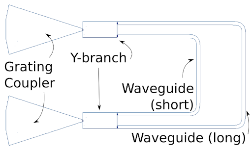

# EC601A1_14
EC601 semester long research project simulating the use of photonics to compute matrix multiplications

## Sprint 1
### Project Mission
Perform the matrix multiplications of various different size data sets on FPGA and Optical Processor

### MVP
Simulation and test benchmarks showing the difference between FPGA and Optical Processor

### Simulation and Hardware Options
1. Simphony
- Simulates photonic circuit in Python
- Open source software that is frequently being updated 
2. Noxim
- Simulates photonic circuit in C++
- Open source software that is not frequently being updated
3. FPGA
- Electronic Circuit
- Easy to Obtain

### Next Sprint Goals
1. Research and Acquire Necessary Hardware
2. Decide what simulation software(s) to utilize to achieve MVP
3. Start writing Verilog Files to load onto FPGA
4. Research current photonic hardware that is available for purchase by the public 

## Sprint 2

The team decided to split into two groups. One will focus on the FPGA while the other Photonic Simulations. **This repo is now dedicated to just the photonic simulations**

### New MVP
Simulate photonic processor performing a successful matrix multiplication

### Simulating with Simphony
We are able to simulate photonic circuits with an open source project called Simphony. Below is an image of a Mach-Zehnder Interferometer(MZI) and the code used to simulate that component.

## Sprint 3
Using an MZI we have now simulated a laser being shot into the device and recorded it's output. The beam is split along two paths of different lengths and then recombined. Because the paths are of different lengths there is interference upon recombination. This is what is shown in the graph below.

